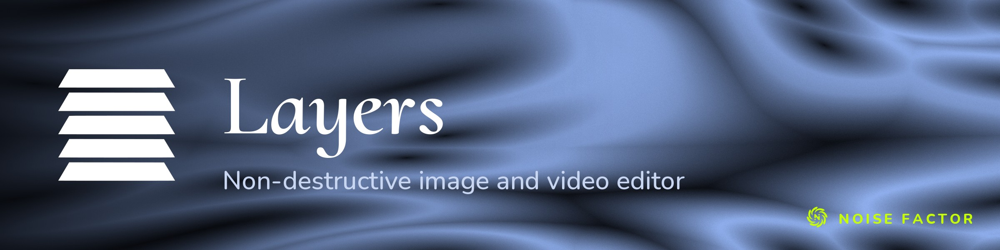

<!-- repo-hero -->
<a href="https://layers.noisefactor.io/"></a>

<sub>Open source from <a href="https://noisefactor.io">Noise Factor</a> &middot; <a href="https://github.com/noisefactorllc">more projects</a></sub>

# Layers

Layers is a browser-based media editor with non-destructive layer compositing, powered by the Noisemaker shader pipeline. It runs entirely client-side.

## Features

- Layer stack with opacity, blend modes, visibility, and locking
- GPU-accelerated effects via WebGL shaders (blur, warp, noise, edge detection, dither, and others)
- Selection tools: rectangle, oval, lasso, polygon, magic wand
- Selection operations: expand, contract, feather, smooth, border, color range
- Image and video layer support
- Copy/paste, crop to selection, canvas resize, image resize
- Project persistence via IndexedDB
- Undo/redo with debounced parameter tracking
- Online collaboration (see below)

## Requirements

- Node.js and npm
- A browser with WebGL2 support

## Development

```
npm install
npm run dev
```

This starts a local server on port 3002.

### Noisemaker

The shader pipeline is loaded at runtime from the [Noisemaker](https://github.com/noisefactorllc/noisemaker) CDN at `shaders.noisedeck.app`.

## Testing

End-to-end tests use Playwright:

```
npm test
```

## Online collaboration

"go online..." (File menu) shares the current composition live via
[Seance](https://seance.noisefactor.io); anyone with the link can join and
edit together in real time. Only Layers sessions are supported — Layers
can't open a session created by a different Seance-connected app, and vice
versa. Media layers (images/video clips) aren't supported in shared
sessions yet, since their bytes live only in your browser's local storage;
take a composition online only after removing any media layers.

## Third-Party Libraries

- [Noisemaker](https://github.com/noisefactorllc/noisemaker) — WebGL shader pipeline (MIT License)
- [Mediabunny](https://github.com/Vanilagy/mediabunny) by Vanilagy — MP4 video encoding via WebCodecs (MPL-2.0 License)
- [JSZip](http://stuartk.com/jszip) — ZIP file generation (MIT License or GPLv3)
- Cormorant Upright, Nunito, Noto Sans Mono — typefaces (OFL-1.1)
- Material Symbols Outlined — icon font by Google (Apache 2.0 License)

## License

Layers is released under the [MIT License](LICENSE). Use of name in derivative products is subject to the [Trademark Policy](TRADEMARK.md).

Copyright 2026 [Noise Factor LLC](https://noisefactor.io/)
